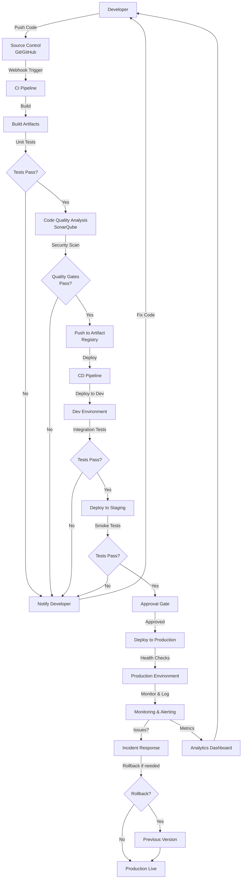

```mermaid
flowchart TB
    A["Developer"] -- Push Code --> B["Source Control<br>Git/GitHub"]
    B -- Webhook Trigger --> C["CI Pipeline"]
    C -- Build --> D["Build Artifacts"]
    D -- Unit Tests --> E{"Tests Pass?"}
    E -- No --> F["Notify Developer"]
    F -- Fix Code --> A
    E -- Yes --> G["Code Quality Analysis<br>SonarQube"]
    G -- Security Scan --> H{"Quality Gates<br>Pass?"}
    H -- No --> F
    H -- Yes --> I["Push to Artifact<br>Registry"]
    I -- Deploy --> J["CD Pipeline"]
    J -- Deploy to Dev --> K["Dev Environment"]
    K -- Integration Tests --> L{"Tests Pass?"}
    L -- No --> F
    L -- Yes --> M["Deploy to Staging"]
    M -- Smoke Tests --> N{"Tests Pass?"}
    N -- No --> F
    N -- Yes --> O["Approval Gate"]
    O -- Approved --> P["Deploy to Production"]
    P -- Health Checks --> Q["Production Environment"]
    Q -- Monitor & Log --> R["Monitoring & Alerting"]
    R -- Issues? --> S["Incident Response"]
    S -- Rollback if needed --> T{"Rollback?"}
    T -- Yes --> U["Previous Version"]
    T -- No --> V["Production Live"]
    U --> V
    R -- Metrics --> W["Analytics Dashboard"]
    W --> A
```
