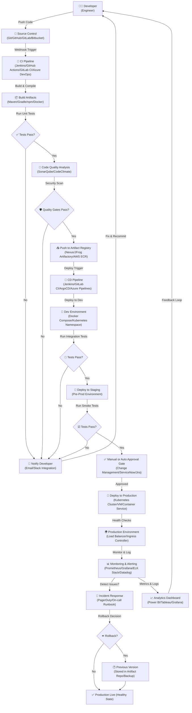

```mermaid
---
config:
  theme: mc
  layout: dagre
---
flowchart TB
    %% --- Source & Build Stage ---
    A["👩‍💻 Developer<br>(Engineer)"] -- Push Code --> B["🧭 Source Control<br>(Git/GitHub/GitLab/Bitbucket)"]
    B -- Webhook Trigger --> C["🔧 CI Pipeline<br>(Jenkins/GitHub Actions/GitLab CI/Azure DevOps)"]
    C -- Build & Compile --> D["📦 Build Artifacts<br>(Maven/Gradle/npm/Docker)"]
    D -- Run Unit Tests --> E{"✅ Tests Pass?"}
    E -- No --> F["📩 Notify Developer<br>(Email/Slack Integration)"]
    F -- Fix & Recommit --> A
    E -- Yes --> G["🧠 Code Quality Analysis<br>(SonarQube/CodeClimate)"]
    G -- Security Scan --> H{"🛡️ Quality Gates Pass?"}
    H -- No --> F
    H -- Yes --> I["📥 Push to Artifact Registry<br>(Nexus/JFrog Artifactory/AWS ECR)"]

    %% --- Deployment & Verification Stage ---
    I -- Deploy Trigger --> J["🚀 CD Pipeline<br>(Jenkins/GitLab CI/ArgoCD/Azure Pipelines)"]
    J -- Deploy to Dev --> K["🌱 Dev Environment<br>(Docker Compose/Kubernetes Namespace)"]
    K -- Run Integration Tests --> L{"🧪 Tests Pass?"}
    L -- No --> F
    L -- Yes --> M["🔁 Deploy to Staging<br>(Pre-Prod Environment)"]
    M -- Run Smoke Tests --> N{"☑️ Tests Pass?"}
    N -- No --> F
    N -- Yes --> O["✅ Manual or Auto Approval Gate<br>(Change Management/ServiceNow/Jira)"]

    %% --- Production & Operations Stage ---
    O -- Approved --> P["🚢 Deploy to Production<br>(Kubernetes Cluster/VM/Container Service)"]
    P -- Health Checks --> Q["🌍 Production Environment<br>(Load Balancer/Ingress Controller)"]
    Q -- Monitor & Log --> R["📊 Monitoring & Alerting<br>(Prometheus/Grafana/ELK Stack/Datadog)"]
    R -- Detect Issues? --> S["🚨 Incident Response<br>(PagerDuty/On-call Runbook)"]
    S -- Rollback Decision --> T{"⏪ Rollback?"}
    T -- Yes --> U["🕑 Previous Version<br>(Stored in Artifact Repo/Backup)"]
    T -- No --> V["✅ Production Live (Healthy State)"]
    U --> V
    R -- Metrics & Logs --> W["📈 Analytics Dashboard<br>(Power BI/Tableau/Grafana)"]
    W -- Feedback Loop --> A
```
