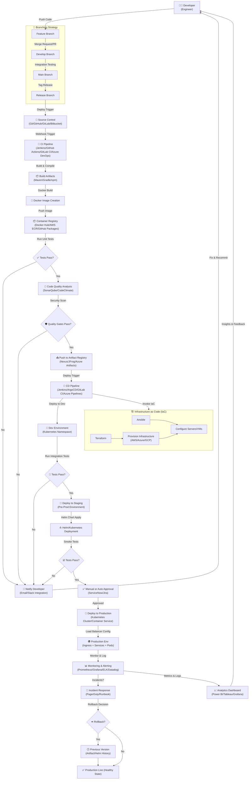

```mermaid
---
config:
  theme: mc
  layout: dagre
---
flowchart TD
    %% --- Developer at top ---
    A["👩‍💻 Developer<br>(Engineer)"]

    %% --- Branching strategy layer ---
    subgraph Branching["🔀 Branching Strategy"]
        F1["Feature Branch"]
        F2["Develop Branch"]
        F3["Main Branch"]
        F4["Release Branch"]
        F1 -->|Merge Request/PR| F2 -->|Integration Testing| F3 -->|Tag Release| F4
    end

    %% --- Source & Build Stage ---
    A -->|Push Code| F1
    F4 -->|Deploy Trigger| B["🧭 Source Control<br>(Git/GitHub/GitLab/Bitbucket)"]
    B -->|Webhook Trigger| C["🔧 CI Pipeline<br>(Jenkins/GitHub Actions/GitLab CI/Azure DevOps)"]
    C -->|Build & Compile| D["📦 Build Artifacts<br>(Maven/Gradle/npm)"]
    D -->|Docker Build| D2["🐳 Docker Image Creation"]
    D2 -->|Push Image| D3["📦 Container Registry<br>(Docker Hub/AWS ECR/GitHub Packages)"]
    D3 -->|Run Unit Tests| E{"✅ Tests Pass?"}
    E -->|No| F["📩 Notify Developer<br>(Email/Slack Integration)"]
    F -->|Fix & Recommit| A
    E -->|Yes| G["🧠 Code Quality Analysis<br>(SonarQube/CodeClimate)"]
    G -->|Security Scan| H{"🛡️ Quality Gates Pass?"}
    H -->|No| F
    H -->|Yes| I["📥 Push to Artifact Registry<br>(Nexus/JFrog/Azure Artifacts)"]

    %% --- IaC Layer ---
    subgraph IaC["🏗️ Infrastructure as Code (IaC)"]
        X1["Terraform"] --> X2["Provision Infrastructure<br>(AWS/Azure/GCP)"]
        X3["Ansible"] --> X4["Configure Servers/VMs"]
        X2 --> X4
    end

    %% --- Deployment & Orchestration Stage ---
    I -->|Deploy Trigger| J["🚀 CD Pipeline<br>(Jenkins/ArgoCD/GitLab CI/Azure Pipelines)"]
    J -->|Invoke IaC| IaC
    J -->|Deploy to Dev| K["🌱 Dev Environment<br>(Kubernetes Namespace)"]
    K -->|Run Integration Tests| L{"🧪 Tests Pass?"}
    L -->|No| F
    L -->|Yes| M["🔁 Deploy to Staging<br>(Pre-Prod Environment)"]
    M -->|Helm Chart Apply| M2["⛵ Helm/Kubernetes Deployment"]
    M2 -->|Smoke Tests| N{"☑️ Tests Pass?"}
    N -->|No| F
    N -->|Yes| O["✅ Manual or Auto Approval<br>(ServiceNow/Jira)"]

    %% --- Production & Operations Stage ---
    O -->|Approved| P["🚢 Deploy to Production<br>(Kubernetes Cluster/Container Service)"]
    P -->|Load Balancer Config| Q["🌍 Production Env<br>(Ingress + Services + Pods)"]
    Q -->|Monitor & Log| R["📊 Monitoring & Alerting<br>(Prometheus/Grafana/ELK/Datadog)"]
    R -->|Incidents?| S["🚨 Incident Response<br>(PagerDuty/Runbook)"]
    S -->|Rollback Decision| T{"⏪ Rollback?"}
    T -->|Yes| U["🕑 Previous Version<br>(Artifact/Helm History)"]
    T -->|No| V["✅ Production Live (Healthy State)"]
    U --> V
    R -->|Metrics & Logs| W["📈 Analytics Dashboard<br>(Power BI/Tableau/Grafana)"]
    W -->|Insights & Feedback| A
```
